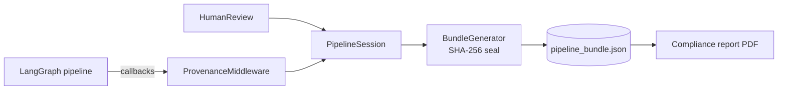

# agent-prov — AI Agent Provenance & Compliance Protocol

A provenance protocol for LLM multi-agent pipelines that captures automated agent
steps, tool calls, and **human oversight intervention events** — designed to
produce verifiable evidence for EU AI Act Articles 12 (record-keeping), 14 (human
oversight), and 50 (transparency).

> **Status: research proof-of-concept (v1.0.0).** This repository accompanies an
> MSc thesis. The protocol schemas and the LangGraph reference implementation are
> functional and tested and the core API is stable as of `1.0.0`; the
> accompanying thesis is still in progress.

---

## What this is

Most provenance work for AI pipelines records what the *machines* did. The EU AI
Act also requires evidence of what the *humans* did — that a person reviewed an
agent's output, what they changed, and when. No existing provenance standard
models that.

`agent-prov` is a small protocol plus a reference implementation that records
both. It defines four record types, captures them automatically from a running
LangGraph pipeline via a non-invasive middleware, seals them into a
tamper-evident bundle, and can render the bundle as a compliance report that maps
each record to the Act clauses it discharges.

The central contribution is the **Human Intervention Record**: a record type that
captures a human oversight decision — who reviewed an output, the action they took
(`approved` / `rejected` / `edited` / `escalated`), and the before/after state of
the output — and maps it to the EU AI Act's oversight obligations.



The middleware observes the pipeline through LangChain callbacks; human decisions
enter through `HumanReview`; both converge on one session that is sealed into a
tamper-evident bundle and can be rendered as a compliance report.

### The four record types

| Record | Captures |
|--------|----------|
| **Agent Step** | A single LLM agent node execution (model id/version, input/output hashes, timestamps) |
| **Tool Invocation** | A single tool/function call made by an agent |
| **Human Intervention** | A human oversight decision: reviewer, action, before/after output hashes, timestamp |
| **Pipeline Bundle** | The sealed container for one pipeline run, with a SHA-256 integrity hash over all records |

Content is recorded as **SHA-256 hashes**, not raw text: the bundle is a
tamper-evident chain of *commitments*, and the original content can live in a
separate, access-controlled store. Hashing uses canonical JSON per
[RFC 8785](https://www.rfc-editor.org/rfc/rfc8785), so any conformant verifier
reproduces the digests byte-for-byte.

---

## Quick start

The project uses [`uv`](https://docs.astral.sh/uv/) for environment and
dependency management.

```bash
# install the environment (Python >=3.12)
uv sync

# run a fully-automated pipeline (researcher -> summarizer -> writer)
uv run python demos/langchain/research/mock.py

# run a pipeline with human-in-the-loop review
uv run python demos/langchain/document_review/mock.py

# run a tool-calling agent (model emits parallel tool calls)
uv run python demos/langchain/tool_calling/mock.py

# run a biometric pipeline whose match needs two-person verification (Art. 14(5))
uv run python demos/langchain/biometric_review/mock.py
```

Each demo writes a sealed bundle (`*_bundle.json`) next to its script and prints
the record chain. The `mock.py` variants are deterministic and make no network
calls; the `live.py` variants run the same graphs against a real model (set
`OPENAI_API_KEY`, optionally in a `.env` file).

### Generate a compliance report

```bash
uv run python -m agent_prov.reporting demos/langchain/research/mock_bundle.json report.pdf
```

This renders a PDF that maps each record to the EU AI Act clauses its fields
substantiate. (PDF rendering needs the `reporting` extra, which `uv sync`
installs by default.)

### Independently verify a bundle

A sealed bundle is evidence only if a third party can recompute its guarantees
without trusting the producer. The verifier does exactly that — recompute the
`bundle_hash`, re-run schema and conditional validation, and check parent-chain
and identifier integrity — and reports every problem it finds. It also surfaces a
non-fatal observation: records whose execution intervals overlap ran
concurrently, so the chronological parent chain orders them sequentially only as
an approximation. This is a `warning`, not a failure — a parallel pipeline is a
valid, untampered bundle.

```bash
uv run python -m agent_prov.verify demos/langchain/research/mock_bundle.json
```

It runs on the bare core (no extras) and exits non-zero if any check fails
(warnings do not affect the exit code). The same checks are available
programmatically:

```python
from agent_prov import verify_bundle

result = verify_bundle(bundle)        # VerificationResult(ok=..., errors=(...), warnings=(...))
```

The core protocol surface — `PipelineSession`, `BundleGenerator`,
`verify_bundle`, `validate_bundle`, `now_iso8601` — is re-exported from the
top-level `agent_prov` package and pulls in no optional extra. (The
`ProvenanceMiddleware` adapter and the `ComplianceReport` renderer stay behind
their `langchain` / `reporting` extras and are imported from their own modules.)

### Survive a crash before sealing

Records live in memory until the bundle is sealed, so a crash mid-run would lose
the evidence — including the failed run an auditor most wants. Attach an
append-only NDJSON event log and every record is streamed to disk (flushed and
`fsync`'d) as it is added:

```python
from agent_prov import PipelineSession, EventLog

with EventLog("run.ndjson") as log:
    session = PipelineSession(event_log=log)
    ...  # run the pipeline; records are now durable as they are emitted
```

After a crash, recover the log into a session and seal it as usual — from the
CLI, or programmatically with `recover_session`:

```bash
uv run python -m agent_prov.persistence run.ndjson recovered_bundle.json --outcome aborted
```

A half-written final line (a crash mid-write) is tolerated; the recovered bundle
is re-validated and its `bundle_hash` recomputed at seal time. This is core
functionality — no extra required.

### Sign a bundle for attributable evidence

The `bundle_hash` makes a bundle tamper-*evident* — but anyone can recompute it,
so a modified bundle can simply be re-sealed. A detached Ed25519 signature closes
that gap: it can only be produced by the private-key holder, giving an auditor
non-repudiation and forgery resistance over the seal. The signature covers a
bound payload (`{payload_type, algorithm, signed_hash}`, canonicalized via the
same RFC 8785 path), following in-toto / SLSA / DSSE practice, so it cannot be
lifted to another context. Signing lives behind the `signing` extra; the protocol
core stays crypto-free.

```bash
# generate an Ed25519 keypair
uv run python -m agent_prov.signing keygen --out-private priv.pem --out-public pub.pem

# sign a sealed bundle -> detached bundle.json.sig envelope
uv run python -m agent_prov.signing sign demos/langchain/research/mock_bundle.json --key priv.pem

# verify the bundle against its signature (bind authorship with a trusted key)
uv run python -m agent_prov.signing verify demos/langchain/research/mock_bundle.json --key pub.pem
```

The same operations are available programmatically from `agent_prov.signing`
(`generate_keypair`, `sign_bundle`, `verify_signature`).

### Instrumenting your own pipeline

The LangChain adapter ships under the `langchain` extra (`pip install
agent-prov[langchain]`; already provided by `uv sync`). The middleware is
passive — it attaches through LangChain's standard `callbacks` mechanism and
never appears inside your graph:

```python
from agent_prov.session import PipelineSession
from agent_prov.adapters.langchain import ProvenanceMiddleware
from agent_prov.bundle_generator import BundleGenerator

session = PipelineSession()
middleware = ProvenanceMiddleware(session)

graph.invoke({...}, config={"callbacks": [middleware]})

BundleGenerator(session, disclosure_presented=True).to_file("bundle.json")
```

For human oversight, wrap the decision point in a `HumanReview` block, which emits
a Human Intervention Record with the before/after evidence.

### Instrumenting a framework we don't adapt

The LangChain adapter is one consumer of a framework-neutral seam: the record
factory on `PipelineSession` (`add_agent_step` / `add_tool_invocation` and their
`_error` variants). An agent with no orchestration framework — a plain loop
against a provider SDK — is instrumented by calling the factory directly, with no
adapter machinery:

```python
from agent_prov.session import PipelineSession, now_iso8601

session = PipelineSession()

ts = now_iso8601()
resp = client.chat.completions.create(model="gpt-4o", messages=messages, tools=tools)
session.add_agent_step(
    agent_id="planner", model_id="gpt-4o", model_version="gpt-4o-2024-11-20",
    timestamp_start=ts, input=messages, output=resp.choices[0].message,
)
```

This runs on the bare `agent-prov` core (no `langchain` extra). See
`demos/openai_loop/mock.py` for a complete, runnable example.

---

## Repository layout

```
src/agent_prov/ framework-neutral protocol core (session + record factory, schemas, validation, sealing, HITL)
  schemas/      JSON Schema for the four record types (shipped with the package)
  verify/       independent bundle verifier + `python -m agent_prov.verify` CLI
  persistence/  crash-safe append-only event log + recovery CLI (`python -m agent_prov.persistence`)
  signing/      detached Ed25519 bundle signing + CLI (optional `signing` extra)
  adapters/
    langchain/  LangChain/LangGraph adapter — middleware + emitters (optional `langchain` extra)
  reporting/    compliance report generator (optional `reporting` extra)
demos/          example pipelines: two LangGraph (mock + live), one framework-free loop
evaluation/     completeness audit, overhead benchmark, developer-effort measurement
docs/           protocol design, EU AI Act obligation mapping, gap analysis, design & evaluation write-up
tests/          unit + integration test suite
```

---

## Tests

```bash
uv run pytest
```

The suite also checks that the schema files are well-formed and that the
example documents validate (`tests/unit/test_schemas.py`). To lint the schemas
or validate a document by hand, use the `check-jsonschema` CLI (a dev
dependency):

```bash
# lint the schema files themselves (well-formed draft 2020-12)
uv run check-jsonschema --check-metaschema src/agent_prov/schemas/*.schema.json

# validate a document against a schema
uv run check-jsonschema --schemafile src/agent_prov/schemas/agent_step.schema.json tests/schema_examples/agent_step.valid.json
```

---

## Scope and limitations

- **One packaged adapter.** The protocol core is framework-neutral and the record
  factory is the integration seam; LangGraph is the one adapter shipped as a
  library subpackage. A framework-free agent loop (`demos/openai_loop/`) is
  instrumented inline against the same seam, demonstrating that the factory
  generalizes, but packaged adapters for other frameworks (AutoGen, CrewAI) are
  future work.
- **Research artifact.** This is a research proof-of-concept, not a production
  library. It demonstrates the protocol; it has not been hardened for production
  deployment.
- The protocol records hashes and structure; where and how the underlying content
  is stored is a deployment concern left to the integrator.

---

## Related work

This protocol extends and differentiates from
**PROV-AGENT** (R. Souza et al., *PROV-AGENT: Unified Provenance for Tracking AI
Agent Interactions in Agentic Workflows*, IEEE e-Science, 2025), which captures
automated agent steps but does not model human oversight events and has no
regulatory mapping. It builds on the
[W3C PROV](https://www.w3.org/TR/prov-overview/) foundation. See
`docs/gap_analysis.md` for the full comparison.

---

## Citation & license

This repository accompanies an MSc Software Engineering thesis (in progress). If
you reference it, please cite the thesis (details to follow) and this repository.

Licensed under the **Apache License 2.0** — see [`LICENSE`](LICENSE).
