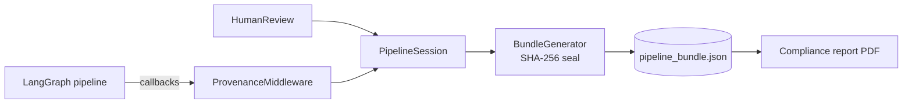

# agent-prov — AI Agent Provenance & Compliance Protocol

A provenance protocol for LLM multi-agent pipelines that captures automated agent
steps, tool calls, and **human oversight intervention events** — designed to
produce verifiable evidence for EU AI Act Articles 12 (record-keeping), 14 (human
oversight), and 50 (transparency).

> **Status: research proof-of-concept, work in progress.** This repository
> accompanies an MSc thesis. The protocol schemas and the LangGraph reference
> implementation are functional and tested, but the project is still under active
> development and APIs may change before a `1.0` release.

---

## What this is

Most provenance work for AI pipelines records what the *machines* did. The EU AI
Act also requires evidence of what the *humans* did — that a person reviewed an
agent's output, what they changed, and when. No existing provenance standard
models that.

`agent-prov` is a small protocol plus a reference implementation that records
both. It defines four record types, captures them automatically from a running
LangGraph pipeline via a non-invasive middleware, seals them into a
tamper-evident bundle, and can render the bundle as a compliance report that maps
each record to the Act clauses it discharges.

The central contribution is the **Human Intervention Record**: a record type that
captures a human oversight decision — who reviewed an output, the action they took
(`approved` / `rejected` / `edited` / `escalated`), and the before/after state of
the output — and maps it to the EU AI Act's oversight obligations.



The middleware observes the pipeline through LangChain callbacks; human decisions
enter through `HumanReview`; both converge on one session that is sealed into a
tamper-evident bundle and can be rendered as a compliance report.

### The four record types

| Record | Captures |
|--------|----------|
| **Agent Step** | A single LLM agent node execution (model id/version, input/output hashes, timestamps) |
| **Tool Invocation** | A single tool/function call made by an agent |
| **Human Intervention** | A human oversight decision: reviewer, action, before/after output hashes, timestamp |
| **Pipeline Bundle** | The sealed container for one pipeline run, with a SHA-256 integrity hash over all records |

Content is recorded as **SHA-256 hashes**, not raw text: the bundle is a
tamper-evident chain of *commitments*, and the original content can live in a
separate, access-controlled store. Hashing uses canonical JSON per
[RFC 8785](https://www.rfc-editor.org/rfc/rfc8785), so any conformant verifier
reproduces the digests byte-for-byte.

---

## Quick start

The project uses [`uv`](https://docs.astral.sh/uv/) for environment and
dependency management.

```bash
# install the environment (Python >=3.12)
uv sync

# run a fully-automated pipeline (researcher -> summarizer -> writer)
uv run python demos/research/mock.py

# run a pipeline with human-in-the-loop review
uv run python demos/document_review/mock.py
```

Each demo writes a sealed bundle (`*_bundle.json`) next to its script and prints
the record chain. The `mock.py` variants are deterministic and make no network
calls; the `live.py` variants run the same graphs against a real model (set
`OPENAI_API_KEY`, optionally in a `.env` file).

### Generate a compliance report

```bash
uv run python -m agent_prov.reporting demos/research/mock_bundle.json report.pdf
```

This renders a PDF that maps each record to the EU AI Act clauses its fields
substantiate. (PDF rendering needs the `reporting` extra, which `uv sync`
installs by default.)

### Instrumenting your own pipeline

The middleware is passive — it attaches through LangChain's standard `callbacks`
mechanism and never appears inside your graph:

```python
from agent_prov.session import PipelineSession
from agent_prov.core import ProvenanceMiddleware
from agent_prov.bundle_generator import BundleGenerator

session = PipelineSession()
middleware = ProvenanceMiddleware(session)

graph.invoke({...}, config={"callbacks": [middleware]})

BundleGenerator(session, disclosure_presented=True).to_file("bundle.json")
```

For human oversight, wrap the decision point in a `HumanReview` block, which emits
a Human Intervention Record with the before/after evidence.

---

## Repository layout

```
schemas/        JSON Schema for the four record types
src/agent_prov/ reference implementation (middleware, emitters, session, HITL, sealing)
  reporting/    compliance report generator (optional `reporting` extra)
demos/          two example pipelines, each with a deterministic and a live variant
evaluation/     completeness audit, overhead benchmark, developer-effort measurement
docs/           protocol design, EU AI Act obligation mapping, gap analysis, design & evaluation write-up
tests/          unit + integration test suite
```

---

## Tests

```bash
uv run pytest
```

---

## Scope and limitations

- **LangGraph only.** The record schemas are framework-agnostic, but the reference
  implementation targets LangGraph. Adapters for other frameworks are future work.
- **Research artifact.** This is a research proof-of-concept, not a production
  library. It demonstrates the protocol; it has not been hardened for production
  deployment.
- The protocol records hashes and structure; where and how the underlying content
  is stored is a deployment concern left to the integrator.

---

## Related work

This protocol extends and differentiates from
**PROV-AGENT** (R. Souza et al., *PROV-AGENT: Unified Provenance for Tracking AI
Agent Interactions in Agentic Workflows*, IEEE e-Science, 2025), which captures
automated agent steps but does not model human oversight events and has no
regulatory mapping. It builds on the
[W3C PROV](https://www.w3.org/TR/prov-overview/) foundation. See
`docs/gap_analysis.md` for the full comparison.

---

## Citation & license

This repository accompanies an MSc Software Engineering thesis (in progress). If
you reference it, please cite the thesis (details to follow) and this repository.

Licensed under the **Apache License 2.0** — see [`LICENSE`](LICENSE).
