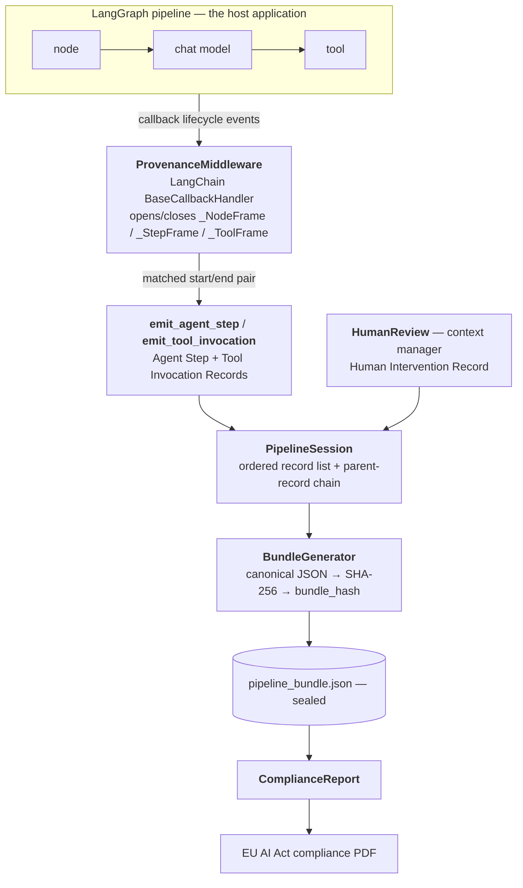

# Chapter 4 — Proof-of-Concept Implementation

## 4.1 Scope of this chapter

Chapter 3 specified the protocol as a static artefact: four record types, their fields, and the EU AI Act clauses each field discharges. This chapter turns to the dynamic side. It describes the reference implementation — a LangGraph middleware that emits the protocol's records automatically from a running multi-agent pipeline, a context manager that captures human oversight decisions, a generator that seals the records into a Pipeline Bundle, and a reporting tool that renders a bundle as a compliance document.

The chapter is organised around the path a single pipeline run takes through the implementation. It opens with the technology choices and project layout (§4.2) and an architecture overview (§4.3). It then follows the data flow: the middleware that listens to pipeline lifecycle events (§4.4), the emitters that turn matched events into records (§4.5), the canonical hashing primitive (§4.6), the session that accumulates records (§4.7), and the bundle generator that seals them (§4.8). Human intervention capture (§4.9) and the compliance report generator (§4.10) follow. The chapter then describes the two demonstration pipelines that exercise the implementation end to end (§4.11), the testing strategy (§4.12), and the limitations of the current implementation (§4.13).

The implementation is the reference against which the protocol is defined: where Chapter 3's tables and the JSON Schemas disagree, the schemas are authoritative; where the protocol's hashing convention is ambiguous, the implementation in `agent_prov/_hashing.py` is authoritative. This chapter therefore doubles as the specification of the canonical hashing form that an independent verifier must reproduce.

---

## 4.2 Technology choices and project layout

**LangGraph as the host framework.** The middleware targets LangGraph, the graph-structured orchestration layer built on LangChain. LangGraph was chosen over the alternatives (AutoGen, CrewAI, bare LangChain) for one decisive reason: it exposes pipeline structure as an explicit directed graph of named nodes, and it routes every node, model, and tool event through LangChain's callback system. The callback system is a stable, documented extension point that does not require modifying user code. A provenance layer built on it is therefore *non-invasive* — the central requirement that follows from the EU AI Act's framing of record-keeping as a technical obligation (§2.5.1). AutoGen and other frameworks are noted as future work in Chapter 6; restricting the proof of concept to one framework keeps the implementation small enough to test exhaustively.

**Python 3.12+, reference environment pinned to 3.14.** The package declares `requires-python = ">=3.12"`. The development and evaluation environment is pinned to CPython 3.14 through a `.python-version` file so that `uv sync` reproduces an identical interpreter across machines.

**`uv` for environment and dependency management.** The project is a `uv` project: `pyproject.toml` declares dependencies, `uv.lock` is committed for reproducibility, and `uv sync` reconstructs the environment from the lockfile. The core runtime dependency set is deliberately minimal — `jsonschema` for schema validation and `rfc8785` for canonical-JSON hashing. The host framework is *not* a core dependency: `langchain-core`, `langgraph`, and `python-dotenv` are pulled by the `langchain` optional extra (§4.2.1), so a deployment that uses only the schemas, validation, session, and bundle sealing installs neither.

**`src/` layout, single package.** Source lives under `src/` as one installable package, `agent_prov`, declared to the Hatchling build backend. Its import name matches the distribution name (`agent-prov`), following the standard one-package-per-distribution convention. The package separates framework-neutral protocol logic from framework- and output-specific code:

- `agent_prov` (top level) — the framework-neutral protocol implementation: the four record schemas and their validation, the `PipelineSession` with its record factory, bundle sealing, canonical hashing, and the `HumanReview` context manager. None of this imports any agent framework.
- `agent_prov.adapters.langchain` — the LangChain/LangGraph adapter: `ProvenanceMiddleware` and the two emitters that translate LangChain callback events into record-factory calls.
- `agent_prov.reporting` — the compliance report generator.

### 4.2.1 Optional extras and the adapter boundary

The two non-core parts are exposed as *optional extras* rather than hard dependencies, because neither is needed by every consumer of the protocol.

`agent_prov.reporting` depends on `fpdf2` for PDF rendering, which an instrumented application does not need at runtime: `pip install agent-prov[reporting]` pulls `fpdf2`; a plain install does not.

`agent_prov.adapters.langchain` depends on `langchain-core` and `langgraph`: `pip install agent-prov[langchain]` pulls them; a plain install does not. This boundary is what makes the "framework-neutral protocol, LangGraph as one adapter" claim concrete rather than aspirational. A deployment can install the bare `agent-prov` to validate bundles, recompute hashes, or build its own adapter for a different framework, without ever pulling LangChain; importing `agent_prov.adapters.langchain` without the extra raises a clean `ModuleNotFoundError`. Both extras are duplicated into the development dependency group so that `uv sync` provisions a complete environment for running the test suite without a separate step.

The `src/` layout with an editable install means `import agent_prov`, `import agent_prov.adapters.langchain`, and `import agent_prov.reporting` resolve identically from the test suite, the demos, and any host application, without `PYTHONPATH` manipulation.

---

## 4.3 Architecture overview

The implementation is a pipeline of five stages. A LangGraph pipeline runs as it normally would; the provenance layer observes it, accumulates records, and seals them. The following diagram describes the data flow.



The automated path (top) and the human-oversight path (`HumanReview`) converge on a single `PipelineSession`; everything downstream of it is framework-agnostic and operates only on the accumulated records.

Three properties of this architecture are worth stating before the component-by-component description.

**Capture is passive.** The middleware is a LangChain callback handler. It is passed into a pipeline run through the standard `config={"callbacks": [...]}` mechanism and never appears in the pipeline's own code. A host application instruments a pipeline by constructing two objects and threading one config key; it does not restructure its graph. This is the practical content of the "non-invasive" claim and is quantified in Chapter 5.

**The automated and human capture paths converge on one session.** Automated steps and tool calls reach the `PipelineSession` through the emitters; human decisions reach it through the `HumanReview` context manager. Both call the same `session.add_record` method, so the chronological `parent_record_id` chain is continuous across the human/automated boundary — a finaliser agent step that runs after a human edit points at the Human Intervention Record, not at the agent step before the edit.

**Sealing and reporting are post-hoc.** The `BundleGenerator` runs once, after the pipeline finishes, over the session's accumulated records. The `ComplianceReport` runs over a sealed bundle file and has no dependency on the middleware at all — it consumes the JSON document, which makes it equally usable on bundles produced by a future, non-LangGraph implementation of the protocol.

---

## 4.4 The middleware: callback-driven capture

### 4.4.1 Why a callback handler

`ProvenanceMiddleware` (`src/agent_prov/adapters/langchain/middleware.py`) subclasses LangChain's `BaseCallbackHandler`. LangChain invokes a callback handler's methods at well-defined points in the execution of a graph: when a node (a *chain*, in LangChain's vocabulary) starts and ends, when a chat model call starts and ends, and when a tool call starts and ends. The middleware implements six of these methods:

| Callback method | LangGraph/LangChain event | Middleware action |
|-----------------|---------------------------|-------------------|
| `on_chain_start` | a graph node begins | open a `_NodeFrame` |
| `on_chain_end` | a graph node finishes | discard the `_NodeFrame` |
| `on_chat_model_start` | a chat model call begins | open a `_StepFrame` |
| `on_llm_end` | a model call finishes | close the `_StepFrame`, emit an Agent Step Record |
| `on_tool_start` | a tool call begins | open a `_ToolFrame` |
| `on_tool_end` | a tool call finishes | close the `_ToolFrame`, emit a Tool Invocation Record |

The handler holds no global state and patches nothing. It is inert until passed into a run, and a run that is not given the handler produces no records. This satisfies the "automatic recording" requirement of Article 12 in the only way that is honest: the recording is automatic *for an instrumented pipeline*, and instrumentation is a single, auditable configuration step.

### 4.4.2 Lifecycle frames

Every callback event carries a `run_id` — a UUID that LangChain assigns to the unit of work and that is identical between the `_start` and the `_end` of that unit. The middleware uses this to pair starts with ends. It maintains three dictionaries keyed by `run_id`:

- `_nodes: dict[UUID, _NodeFrame]`
- `_steps: dict[UUID, _StepFrame]`
- `_tools: dict[UUID, _ToolFrame]`

A `_start` callback constructs a frame — a small dataclass capturing the start timestamp and the raw event payload (the serialised model description, the input messages, the metadata block) — and stores it under the event's `run_id`. The matching `_end` callback pops the frame back out. Because pairing is by `run_id`, concurrent or nested events do not interfere: two model calls in flight at the same time occupy two distinct `_steps` entries.

The three frame types — `_NodeFrame`, `_StepFrame`, `_ToolFrame` — are deliberately thin. They are lifecycle buckets, not records. They hold what the corresponding emitter needs and nothing else. The middleware module owns only this wiring: opening a bucket, closing it, and surfacing the matched pair. All field extraction — deriving `model_id`, computing hashes, resolving `agent_id` — lives in the emitter modules (§4.5), keeping the middleware free of protocol-specific logic.

A node frame outlives the model and tool frames nested inside it. When a model call completes, its `_StepFrame` is gone, but the enclosing node's `_NodeFrame` is still open in `_nodes`. This is what lets the Agent Step emitter resolve which node — which *agent* — issued the call: it looks up the model frame's `parent_run_id` in the still-open `_nodes` dictionary (§4.5.3). The middleware exposes an `in_flight` property reporting the count of unmatched `_start` events; it is used by the test suite to assert that a clean pipeline run leaves no frame open.

### 4.4.3 The `SessionProtocol` seam

The adapter does not depend on the concrete `PipelineSession` class. It depends instead on `SessionProtocol`, a structural `typing.Protocol` that declares the attributes (`pipeline_id`, `session_id`, `protocol_version`, `last_record_id`) and the methods the adapter actually uses: `add_record` and the four record-factory methods (§4.5). Any object exposing that surface is an acceptable session. The protocol lives in `session.py` alongside `PipelineSession`, its canonical implementor — the natural home for the contract once the record factory is a session responsibility (§4.5).

This is a small decision with two payoffs. It documents, in the type system, exactly what the capture layer needs from a session, and it makes the adapter testable against a real `PipelineSession` (or any conforming stub) without coupling to construction details. Because the adapter codes against the structural protocol rather than the class, a second adapter for a different framework reuses the same seam unchanged.

The dependency graph is acyclic by construction. The framework-neutral leaves — `session.py` (which imports only the `_hashing` helpers) and `_hashing.py` (which imports only the standard library and `rfc8785`) — know nothing of any adapter. Within the LangChain adapter, the frame dataclasses live in their own leaf module, `adapters/langchain/_frames`, imported by both the middleware and the emitters; the middleware imports the emitters, the emitters import `_frames` and the core `session`/`_hashing` modules, and nothing in the adapter is imported back by the core. The middleware can therefore import the emitter functions at module load time. An earlier layout kept the frames and hashing helpers in the middleware module itself, which forced function-scope imports to break a cycle; extracting the leaves removed that workaround.

---

## 4.5 The record factory and the emitters

Record assembly is split into two layers. The framework-neutral **record factory** lives on `PipelineSession` and owns everything that is the same regardless of which framework produced the event: filling the constant and session-copied fields, hashing the supplied input and output, stamping `timestamp_end`, wiring the `parent_record_id` chain, and appending. The framework-specific **emitters** live in the adapter and own only the translation from a LangChain lifecycle pair into the primitives the factory needs.

This split is what makes a second adapter cheap. The factory exposes four keyword-only methods — `add_agent_step` and `add_tool_invocation`, each with an `_error` variant — and an adapter for AutoGen or a bare-OpenAI loop would extract its own framework's identity and content and call exactly these, reusing the record shape, the hashing rules, and the parent-chain logic without reimplementing them. In the LangChain adapter there are two emitters, one per automated record type, each a single module exposing one success function and one error function.

### 4.5.1 Agent Step emitter

`emit_agent_step` (`src/agent_prov/adapters/langchain/step_emitter.py`) is called by the middleware when a chat model call completes. It receives the closed `_StepFrame`, the model's response object, the session, and the still-open `_nodes` dictionary. It extracts the LangChain-specific primitives — `agent_id` from the enclosing node (§4.5.3), `model_id`/`model_version` from the frame (§4.5.3), `timestamp_start` from the frame, the semantically projected input message list and output payload (below), and `reference_data_id` from the callback metadata — and passes them to `session.add_agent_step`. The factory then assembles the full Agent Step Record:

- `record_id` — a fresh UUID v4.
- `record_type` — the constant `"agent_step"`.
- `protocol_version`, `pipeline_id`, `session_id` — copied from the session.
- `agent_id`, `model_id`, `model_version`, `timestamp_start` — the primitives supplied by the emitter.
- `timestamp_end` — set by the factory, as the record is assembled.
- `input_hash` — the canonical hash of the projected input message list (the emitter projects, the factory hashes).
- `status` — `"success"` on this path (the model call completed).
- `output_hash` — the canonical hash of the response's semantic payload: per generation, the message content and the (name, args) of any tool calls. The emitter performs this projection because it is LangChain-message-specific; the full response envelope is not hashed because LangChain stamps a fresh runtime `id` on every generated message and on every tool call, which would make identical content digest differently on each run. The projection keeps only what is semantically the model's output, preserving the content-addressable property the protocol relies on. Tool calls are retained — not just `content` — because a step that emits only a tool call carries no content, and hashing content alone would make every such step collide.
- `reference_data_id` — read by the emitter from the frame's callback metadata under the `reference_data_id` key, mirroring how `tool_version` is sourced (§4.5.2); `null` when absent. The identifier cannot be recovered from a generic chat model call, so the application that knows which reference corpus a step consulted supplies it through the run metadata, for example `config={"metadata": {"reference_data_id": "corpus-v3"}}`.
- `parent_record_id` — the session's `last_record_id` (§4.7).

Inside the factory, the success and error methods share an `_agent_step_base` helper that fills the fields above except `status`, `output_hash`, and `error`; the success method then adds `status: "success"` and `output_hash`, and the error method (§4.5.4) adds `status: "error"` and the `error` object instead. The factory appends the finished record through the same `add_record` path used everywhere else, so the parent-chain stays continuous.

### 4.5.2 Tool Invocation emitter

`emit_tool_invocation` (`src/agent_prov/adapters/langchain/tool_emitter.py`) is structurally identical, called when a tool call completes. It extracts `tool_name`/`tool_version` and the tool's input string and passes them, with the output value, to `session.add_tool_invocation`, which produces a `"tool_invocation"` record — replacing `model_id`/`model_version` with `tool_name`/`tool_version` and hashing the input string and output value. The same `status`/`output_hash`/`error` split applies, via the factory's `_tool_invocation_base` helper. The symmetry is deliberate and mirrors the structural symmetry of the two record types described in §3.4.1.

### 4.5.3 Field extraction and its failure modes

Three fields are not simply copied; they are *derived*, and each derivation has a documented fallback.

**`agent_id`.** An agent is a node in the graph. The emitter resolves the agent by looking up the frame's `parent_run_id` in the `_nodes` dictionary; if a `_NodeFrame` is found, its `node_name` — `"researcher"`, `"summarizer"` — becomes the `agent_id`. This is the normal path and yields the stable, human-meaningful role names the protocol intends (§3.7.1). If the parent run is not a tracked node, the emitter falls back to the raw `parent_run_id` string; if there is no parent at all, to the literal `"unknown"`. The fallbacks keep the field schema-valid (a non-empty string) under unusual graph shapes rather than failing the run.

**`model_id` and `model_version`.** Model identity is read from three sources in priority order. First, the LangSmith standard metadata key `ls_model_name`, which is the most reliable source when present. Second, the provider-specific `model` or `model_name` keys in the serialised model description. Third, as a coarse last resort, the model class name (e.g. `"ChatOpenAI"`). `model_version` is read from a `model_version` kwarg if the provider exposes one; most do not, and the field then falls back to the `model_id` string serving as both identifier and version. This fallback is degenerate but well-formed, and matches the protocol's stated handling of providers that do not separate the two (§3.3.2).

**`tool_version`.** The tool version is read from an explicit `version` kwarg in the tool's serialised description, then from a caller-supplied `tool_version` metadata key, and finally defaults to the literal `"unversioned"`. The default satisfies the schema's `minLength: 1` constraint but carries no drift-detection signal, so rather than apply it silently the emitter logs a `WARNING` naming the tool and the degraded obligation. This keeps an uninstrumented tool from crashing the pipeline while making the unmet versioning obligation observable to operators and auditors, who can then supply an explicit version string. The chosen value is recorded in the record itself, so the gap is also evident on later inspection.

These fallbacks share a design stance: a provenance layer must never crash the pipeline it observes, and must never emit a record that fails schema validation. Where a field's ideal source is unavailable, the emitter degrades to a well-formed but less informative value and the degradation is visible in the record itself.

### 4.5.4 Recording failures

A step or tool call that raises is itself an auditable event (§3.3.2, Article 12(2)(a)), so the middleware subscribes to the LangChain error callbacks alongside the success ones. `on_llm_error` and `on_tool_error` pop the still-open frame — the same frame the success callback would have consumed — and route it to `emit_agent_step_error` / `emit_tool_invocation_error`. These extract the same identity, timing, and input primitives as the success emitters, plus the exception's class name and message, and call the factory's `add_agent_step_error` / `add_tool_invocation_error`. The factory builds the record from the shared base helper, then sets `status: "error"`, omits `output_hash` (a failed call produced none), and attaches a structured `error` object: `type` (the exception class name), `message_hash` (the canonical hash of `str(error)`), and `source` (`"provider"` for a model call, `"tool"` for a tool call). The record carries the same identity, timing, and input hash as a successful one, so a failure is fully attributable.

Two further points. First, popping the frame in the error callback is also what prevents a leak: without it, a frame opened on `*_start` whose run ends in error would never be removed from the in-flight dictionaries. Second, `on_chain_error` releases the node frame but emits no record — nodes are context for `agent_id` resolution, not events in their own right, so a failed node surfaces through the failed step or tool it contained, not as a record of its own.

The bundle reflects failures at the run level too: the Pipeline Bundle's `outcome` field (§4.8) is derived from the records, reporting `error` when any record carries `status: "error"`.

### 4.5.5 The adapter contract, and instrumenting a framework without callbacks

The record factory is the protocol's framework-neutral seam (§4.5). An *adapter* is any code that observes some agent runtime, extracts the primitives a record needs — identity, model or tool name, the start timestamp, and the projected input and output content — and calls the four factory methods. The factory owns everything that is the same regardless of provenance source: the constant and session-copied fields, canonical hashing, `timestamp_end`, the `parent_record_id` chain, and the append. An adapter never reimplements any of that. This is what makes the protocol's central claim — framework-neutral, with LangGraph as *one* adapter — concrete rather than aspirational: a second adapter targets the same factory, and the verifier, the validator, and the bundle format never learn which adapter produced a record.

The LangChain adapter (§4.4–§4.5) is the elaborate case, because LangChain exposes a rich extension point — the callback system — and the adapter is built to exploit it: a `BaseCallbackHandler`, `run_id`-keyed lifecycle frames, and start/end pairing. That machinery is reusable across every LangGraph application, which is exactly why it is worth packaging as a library subpackage behind the `langchain` extra.

Not every runtime offers such a hook. A great many agents are written as a plain loop directly against a provider SDK — `client.chat.completions.create(...)` in a `while` loop, with tool calls dispatched by hand — and have no callback system to subscribe to. The protocol instruments these by the same contract, but without any adapter machinery: the loop simply calls the factory at the two points that matter. `demos/openai_loop/mock.py` is a complete worked example. Its entire provenance integration is two calls:

```python
ts = now_iso8601()
completion = client.create(model=MODEL, messages=messages, tools=tools)
message = completion.choices[0].message
session.add_agent_step(
    agent_id=agent_id, model_id=MODEL, model_version=MODEL,
    timestamp_start=ts, input=_project_all(messages), output=_project(message),
)
# ... and around each dispatched tool call:
session.add_tool_invocation(
    agent_id=agent_id, tool_name=call.function.name, tool_version="1.0.0",
    timestamp_start=ts, input=args, output=result,
)
```

There is no callback handler, no frame bookkeeping, and no `agent_id` derivation from a graph — the loop already knows which agent it is running, so it passes the name as a string. Only the semantic projection survives from the LangChain adapter, and for the same reason: the provider response carries a runtime `id` per message and per tool call, so the loop projects to (role, content, tool-call name/args) before hashing, keeping `input_hash` / `output_hash` replay-stable (§4.5.1). The demo runs on the bare `agent-prov` core — it imports no agent framework and does not need the `langchain` extra — and its sealed bundle validates and recomputes identically to the LangChain demos' bundles. The one helper it needs beyond the factory — `now_iso8601`, to stamp `timestamp_start` before the call — is re-exported from `agent_prov.session`, so an adapter author imports everything from one public module and never reaches into package internals.

The asymmetry between the packaged adapter and the framework-free loop is deliberate and is itself the argument for where the abstraction boundary sits. A framework with reusable extension machinery (LangGraph) earns a packaged adapter; a framework with none (a hand-written loop) is instrumented inline by calling the factory directly. Both converge on the same `PipelineSession`, produce the same record shapes, and seal into the same bundle format — which is the strongest available evidence that the factory, not the LangChain middleware, is the protocol's true integration surface.

---

## 4.6 Canonical hashing

All content hashing in the implementation goes through two functions in `_hashing.py`.

`canonical_json_sha256(obj)` is the protocol's canonical-form primitive. It serialises `obj` to canonical bytes with the `rfc8785` library — an implementation of RFC 8785, the JSON Canonicalisation Scheme — and returns the SHA-256 hex digest of those bytes. The canonical form sorts object keys lexicographically by Unicode code point, emits no insignificant whitespace, preserves non-ASCII characters as UTF-8 rather than `\u`-escaping them, and applies ECMAScript number formatting so that an integer-valued float and its integer counterpart — for example `1.0` and `1` — produce identical bytes. `NaN` and `Infinity` are rejected: these are not portable in JSON and a provenance hash should fail loudly rather than digest an unrepresentable float. The function expects its input to be JSON primitives already; callers holding richer objects go through `hash_content`.

`hash_content(obj)` is the function the emitters and `HumanReview` actually call. It first passes `obj` through `_to_serializable`, which recursively unwraps Pydantic and LangChain objects — anything exposing `model_dump` or `dict` — into plain JSON primitives and stringifies any remaining non-JSON leaf such as a `UUID` or `datetime`, then delegates to `canonical_json_sha256`. This is what lets the emitters hash a list of `BaseMessage` objects or a raw tool return value without the caller pre-normalising it.

The canonical form conforms to RFC 8785: canonicalisation is delegated to the `rfc8785` library rather than hand-rolled, and the one genuinely hard part of the scheme — ECMAScript number formatting — is therefore handled by a conformant implementation rather than reimplemented. The consequence, stated plainly: an independent verifier using any conformant JCS library recomputes a digest byte-for-byte, without having to reproduce an implementation-specific formatting rule. The division of labour — `_to_serializable` reduces application objects to JSON primitives, `rfc8785` canonicalises them — is documented in the `_hashing.py` docstrings so that it is discoverable from the code, not only from the documentation.

---

## 4.7 The `PipelineSession` and the parent chain

`PipelineSession` (`src/agent_prov/session.py`) is the accumulator. It is constructed once per pipeline run and holds:

- `pipeline_id` — supplied by the caller when one logical pipeline definition spans multiple runs (retries, scheduled executions), or a fresh UUID otherwise.
- `session_id` — always a fresh UUID, identifying this single run.
- `protocol_version` — the semver string stamped on every record, defaulting to `"0.2.0"`.
- `records` — the ordered list of emitted record dictionaries.
- `last_record_id` — the `record_id` of the most recently appended record.

`add_record` does exactly two things: it appends the record to `records`, and it updates `last_record_id` to that record's id.

`last_record_id` is the mechanism behind the `parent_record_id` chain. Every emitter, and the `HumanReview` context manager, reads `session.last_record_id` *before* appending its own record and writes that value into the new record's `parent_record_id`. The first record in a run reads `None` and is the chain's head. Every subsequent record points at its immediate predecessor in emission order. Because emission order is the order in which lifecycle events completed, the chain is *chronological*: it records the sequence in which events were observed, not a causal derivation graph. §3.7.3 discusses this choice and the case for a future causal `caused_by_record_id` field. The implementation keeps the simpler structure and the single `last_record_id` cursor that produces it.

---

## 4.8 The `BundleGenerator` and the integrity seal

`BundleGenerator` (`src/agent_prov/bundle_generator.py`) runs once, after the pipeline finishes, and turns a session into a sealed Pipeline Bundle. It is constructed with the session, a `disclosure_presented` boolean — the Article 50(1) flag, which the application supplies because only the application knows whether an AI-interaction disclosure was shown to the user — and an optional `outcome`.

`generate()` assembles the bundle dictionary: a fresh `bundle_id`, the `"pipeline_bundle"` discriminator, the protocol version and identifiers copied from the session, a `created_at` timestamp, the `disclosure_presented` flag, the run `outcome`, the ordered `records` list, and a `bundle_hash` field initialised to the empty string. An empty session is rejected with a `ValueError` — the Pipeline Bundle schema requires at least one record, and a run that emitted nothing is an error to surface, not an empty document to seal.

The `outcome` (§3.6.2) is derived when not supplied explicitly: `error` if any record carries `status: "error"`, otherwise `completed`. The application can override it — most usefully to `aborted`, which the generator cannot infer because a run stopped before its end looks, from the records alone, like one that simply finished. This is the one piece of run-level state the bundle adds on top of the per-record evidence.

Once assembled, the bundle is validated through the single validation surface (§3.7.5) before it is returned — structure plus the conditional rules, for the bundle and every record — so a malformed bundle is caught at seal time rather than reaching an auditor. This runs only after the observed pipeline has finished, preserving the rule that the provenance layer never crashes the pipeline mid-run.

The seal is then computed. `compute_bundle_hash` builds a copy of the bundle with the `bundle_hash` key removed and runs it through `canonical_json_sha256`; the resulting digest is written back into `bundle_hash`. Excluding the field from its own input breaks the obvious circularity of a hash that would otherwise have to contain itself. Verification is the same procedure in reverse, and the test suite performs it: strip `bundle_hash`, recompute, compare.

`to_file(path)` calls `generate()` and writes the bundle to disk as pretty-printed, UTF-8, non-ASCII-preserving JSON. The on-disk indentation is purely for human readability — it is *not* the canonical form. The hash was computed over the compact canonical serialisation before pretty-printing; a verifier re-canonicalises the parsed document and never hashes the file's bytes directly. Keeping the readable file and the hashed form distinct is deliberate: an auditor can open the bundle in any text editor, and the integrity check is unaffected by how the file was formatted on disk.

---

## 4.9 Human intervention capture: the `HumanReview` context manager

The Human Intervention Record is the protocol's central contribution (§3.5), and its capture mechanism is correspondingly the most carefully designed part of the implementation. It is not an emitter driven by a LangChain callback, because a human decision is not a LangChain event. It is a Python context manager, `HumanReview` (`src/agent_prov/hitl.py`), that the host application wraps around the code path where a human reviews an agent output.

**Construction.** `HumanReview` is constructed with the session, the reviewer identity (a list of strings, supporting Article 14(5)'s two-person rule without a schema fork — §3.5.2), the reviewer role, and `output_before` — the agent output exactly as it was presented to the reviewer. The constructor hashes `output_before` immediately, on entry, capturing the *pre-decision* state before the body of the `with` block can run. It rejects an empty reviewer list or an empty role with a `HITLError`.

**The decision API.** Inside the `with` block the caller commits exactly one decision through one of four methods, one per `action_type`:

| Method | `action_type` | `output_after_hash` |
|--------|---------------|---------------------|
| `approve()` | `approved` | set equal to `output_before_hash` |
| `edit(new_output)` | `edited` | hash of `new_output`, which must differ |
| `reject()` | `rejected` | `null` |
| `escalate()` | `escalated` | `null` |

This API is where the `action_type` ↔ `output_after_hash` conventions of §3.5.3 — conventions the JSON Schema cannot express — are *enforced in code*. `approve()` cannot produce a changed hash because it does not accept a new output; it reuses `output_before_hash` by construction. `edit()` recomputes the hash and raises a `HITLError` if the result equals `output_before_hash`, because an "edit" that changed nothing is an approval and should be recorded as one. `reject()` and `escalate()` hard-code `output_after_hash` to `null`. The schema accepts records that violate these rules; the context manager makes them unconstructible through the supported path.

Each decision method also accepts an optional `justification`. When supplied, it is hashed into the optional `justification_hash` field; when omitted, the field is absent from the record entirely, matching its optional status in the schema (§3.5.5).

**Exit semantics.** The `__exit__` method is where the record is built and emitted, and it enforces three flow rules:

1. *Exactly one decision.* A second call to any decision method raises a `HITLError`; exiting the block with no decision at all raises one too. A `HumanReview` block stands for one oversight act.
2. *A non-null parent.* The record's `parent_record_id` is taken from `session.last_record_id`, and `__exit__` raises if it is `None`. A Human Intervention Record always reviews an upstream record and can never be the head of the chain — the schema makes its `parent_record_id` non-nullable, and the context manager refuses to emit one that would violate that.
3. *No half-built records on error.* If the `with` block exits because its body raised an exception, `__exit__` returns without emitting anything. A provenance record is evidence; emitting one for a review that crashed mid-way would be false evidence.

When all three checks pass, `__exit__` assembles the record — including `intervention_timestamp`, set at exit — and calls `session.add_record`. The record joins the same ordered list and the same chronological chain as the automated records, which is what makes the chain continuous across the human/automated boundary (§4.3).

---

## 4.10 The compliance report generator

The `reporting` package consumes a sealed bundle and produces the auditor-facing artefact: a PDF that maps the bundle, record by record, to the EU AI Act clauses it substantiates.

**`OBLIGATION_MAP` — the single source of truth.** `reporting/obligations.py` holds `OBLIGATION_MAP`, a nested dictionary that, for each record type, maps each field to the list of Act clauses it discharges. This is the executable form of the mapping table presented in §3.8. A companion dictionary, `CLAUSE_DESCRIPTION`, carries the human-readable prose for each clause (e.g. `"Art. 12(3)(a)"` → "Start and end time of each use"). Keeping the mapping in one module means the report, and any future tooling, share one authority rather than re-encoding the table.

**`ComplianceReport`.** The `ComplianceReport` class (`reporting/compliance_report.py`) is constructed from a bundle dictionary; the constructor validates that the object is a `pipeline_bundle` with a `records` list and rejects anything else. It exposes two operations.

`coverage()` returns the clause-coverage matrix: for every clause in `CLAUSE_DESCRIPTION`, the list of record ids (or the bundle id) that satisfy it. A clause is satisfied by an entity when that entity carries at least one *populated* field mapped to the clause. "Populated" is decided by `_field_present`, and one rule in it is load-bearing: a boolean field counts only when `True`. A bundle with `disclosure_presented: false` does not satisfy Article 50(1) — a `false` flag records that the disclosure obligation was *not* met, and counting it as coverage would invert the field's meaning.

`to_pdf(path)` renders the report. The layout proceeds from bundle metadata, through a record summary, to a per-record section — each record's fields followed by the Act clauses those fields map to — and closes with the clause-coverage matrix. Rendering uses `fpdf2`'s table API and the built-in Helvetica core font only, so the PDF carries no font dependency and reproduces identically across machines.

**The command-line entry point.** `agent_prov/reporting/__main__.py` exposes the generator as `python -m agent_prov.reporting <bundle.json> <out.pdf>`. An auditor needs no knowledge of the Python API to turn a bundle into a report. Sample reports for the demonstration pipelines are committed to the repository alongside their bundles.

---

## 4.11 Demonstration pipelines

Two LangGraph demonstration pipelines exercise the LangChain adapter end to end. They live under `demos/langchain/`, grouped to mirror the adapter subpackage they exercise (`agent_prov.adapters.langchain`). Each ships in two variants: a `mock.py` that uses a deterministic fake LLM and makes no network calls, and a `live.py` that uses `ChatOpenAI` against the real API. The mock variants are the ones used as running examples throughout: they are deterministic, reproducible in CI, and produce committed bundles that the reader can inspect. The live variants exist to confirm the middleware behaves identically against a real provider and serve as the target for the overhead benchmark in Chapter 5.

A third demonstration, `demos/openai_loop/`, is the framework-free adapter discussed in §4.5.5: a hand-written agent loop instrumented inline against the record factory, with no LangChain present. It is kept outside `demos/langchain/` precisely because it uses no adapter package — the directory layout reflects the adapter boundary. It is not one of the evaluation subjects (Chapter 5 measures the two LangGraph pipelines); its role is to demonstrate that the factory seam carries a non-callback mechanism and that a bundle can be produced on the bare core.

The fake LLM is a small `BaseChatModel` subclass returning a fixed response. It is a genuine LangChain chat model, so a call to it triggers the same `on_chat_model_start` / `on_llm_end` callbacks as a real provider — the middleware cannot tell the difference, which is exactly what makes the mock variant a valid test of the capture path.

Instrumenting either pipeline requires three lines: construct a `PipelineSession`, construct a `ProvenanceMiddleware` over it, and pass the middleware in the run's `callbacks` config. No node function is aware of the provenance layer. This is the non-invasiveness claim made concrete, and Chapter 5 quantifies it as an instrumentation-effort measurement.

### 4.11.1 Research assistant pipeline

The first pipeline (`demos/langchain/research/`) is a three-agent research assistant: a `researcher` node, a `summarizer` node, and a `writer` node, wired as a linear LangGraph. The researcher first calls a `web_search` tool, then synthesises the tool's result with its LLM; the summarizer condenses the researcher's notes; the writer produces a final report.

This pipeline exercises the fully automated path. Its bundle contains four records — one `tool_invocation` for the web search, followed by three `agent_step` records, one per node — chained chronologically. It demonstrates the structural symmetry of the two automated record types and the chronological-chain property where a tool invocation precedes the agent step that consumed it (§3.7.3). The pipeline is run with `disclosure_presented=True`.

### 4.11.2 Document review pipeline

The second pipeline (`demos/langchain/document_review/`) is the one that exercises the protocol's central contribution. It models a credit-decision workflow: a `summarizer` agent condenses a loan application, a human editor reviews and *edits* the summary, a `finalizer` agent drafts a decision letter from the edited summary, and a compliance officer *approves* the letter. The resulting bundle contains four records in the order `agent_step`, `human_intervention`, `agent_step`, `human_intervention`.

This bundle is the concrete demonstration of two claims. First, the `parent_record_id` chain runs continuously through human and automated records alike: the finaliser's `agent_step` points at the editor's `human_intervention` record, not at the summarizer's `agent_step`. Second, it shows two of the four `action_type` values — `edited` and `approved` — with their distinct `output_after_hash` shapes: the edited record carries a hash that differs from `output_before_hash`, the approved record carries one equal to it.

The workflow is one multi-node LangGraph — `summarizer → review_summary → finalizer → approve_letter → END` — in which the two review points are gate nodes that call LangGraph's `interrupt()`. When a gate is reached the graph pauses and returns control to the runner, which collects the human decision in a `HumanReview` block and resumes the graph with `Command(resume=…)`. Because every invocation shares one session and middleware, `session.last_record_id` persists across the pause and each Human Intervention Record chains onto the agent step it reviewed; a node-level interrupt requires a checkpointer, so the graph is compiled with an in-memory `MemorySaver`. One seam remains, carried forward to Chapter 6 (§6.5.6): the Human Intervention Record is still emitted by the runner on resume rather than from inside the gate node, because the human decision occurs out of process while the graph is paused.

---

## 4.12 Testing strategy

The implementation is covered by 138 tests, organised into a unit suite and one integration test.

The **unit suite** tests each component in isolation: the four JSON Schemas and the bundle hash; the validation surface; the `ProvenanceMiddleware` lifecycle; each of the two emitters; the `PipelineSession`; the `BundleGenerator`; the `HumanReview` context manager across all four action types; and the `ComplianceReport`. The obligations the JSON Schema cannot express — the `timestamp_end >= timestamp_start` ordering on Agent Step and Tool Invocation Records, and the `action_type` ↔ `output_after_hash` conditional rules on the Human Intervention Record — are enforced by a dedicated validation module (`src/agent_prov/validation.py`) and exercised directly through its `validate_record` / `validate_bundle` entry points. Because `BundleGenerator` runs `validate_bundle` at seal time, every bundle the suite produces is validated through that same single surface, so structural and conditional conformance are defined in one place rather than re-implemented per test.

The **integration test** (`tests/integration/test_middleware_pipeline.py`) builds a minimal LangGraph pipeline in-process — an analyst node with a tool call, a `HumanReview` edit, and a finaliser node — drives it through the full stack, and asserts four things about the resulting bundle: it validates against the Pipeline Bundle schema; the record sequence is exactly `tool_invocation, agent_step, human_intervention, agent_step`; the chronological parent chain is intact, including across the human boundary; and the HITL record's `action_type` and before/after hashes are mutually consistent. The test owns its own pipeline fixture rather than importing a demo, so that it remains stable as the demos evolve for narrative reasons. It is the single test that exercises real LangGraph callback wiring, the composition of both emitters with `HumanReview`, and canonical sealing together — the end-to-end contract the rest of the suite verifies piecewise.

---

## 4.13 Implementation limitations

One limitation of the current implementation is stated here and carried forward to Chapter 6 for fuller discussion. It is recorded now so that the evaluation in Chapter 5 is read against an honest account of what the proof of concept does and does not guarantee.

**The parent chain is chronological, not causal.** `parent_record_id` records emission order, not the "issued-by" relationship between an agent step and the tool call it dispatched. Recovering causal structure is left to an analysis layer or to a future optional `caused_by_record_id` field (§3.7.3).

It does not block the evaluation: it is a documented divergence with a defined resolution. Chapter 5 now turns from how the protocol is implemented to how well it performs: completeness against the Act's obligations, runtime and storage overhead, and instrumentation effort.
